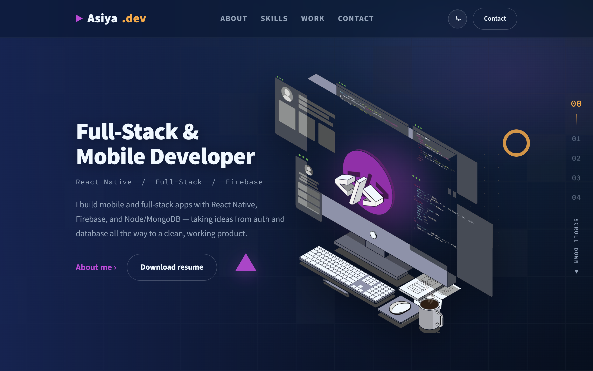
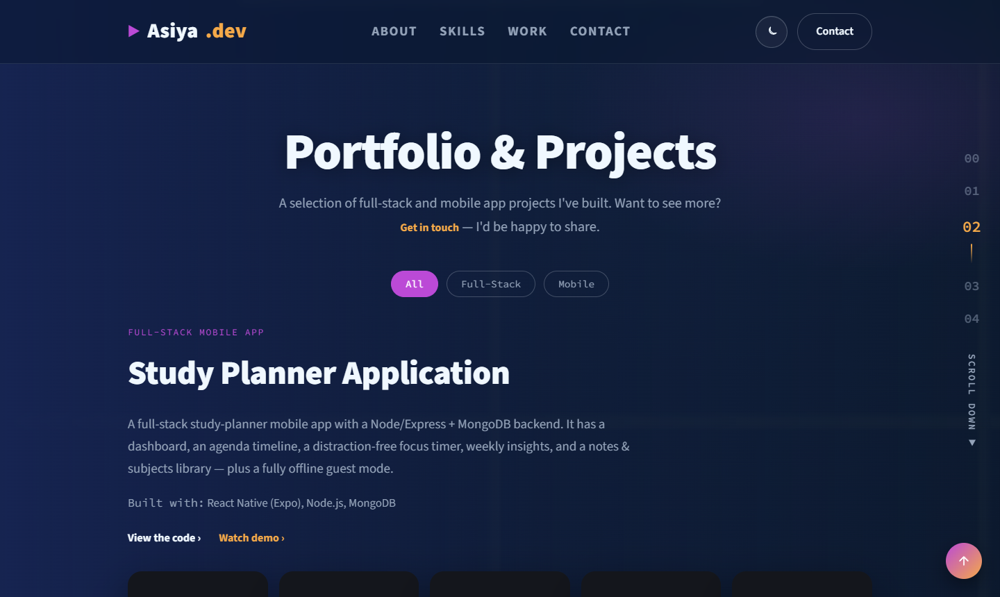
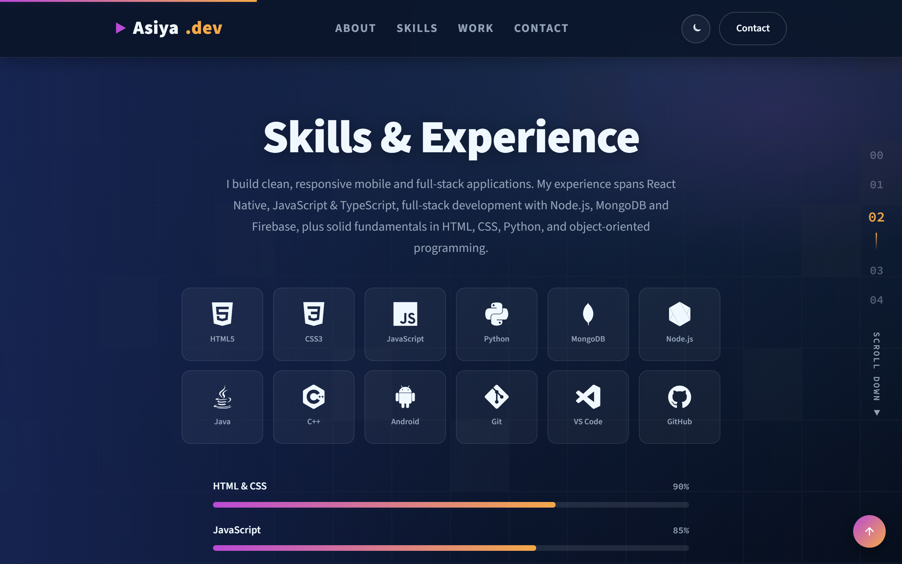
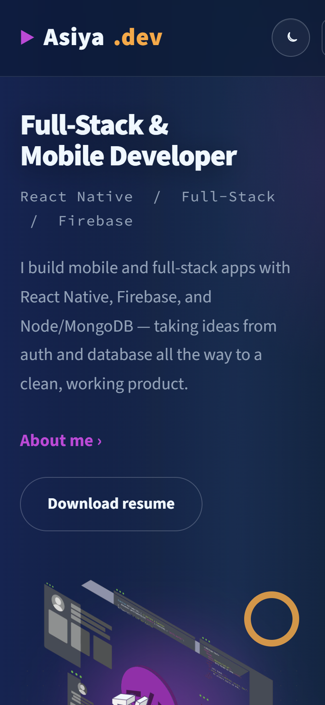

# CloudExify — Project 1: Personal Portfolio Website

A responsive personal portfolio built with **HTML5, CSS3, and vanilla JavaScript** —
no frameworks, no build step. Deployed live on Vercel.

---

## Submission details

| Field                   | Value                                                                                                     |
| ----------------------- | --------------------------------------------------------------------------------------------------------- |
| **Name**                | Asiya Khan                                                                                                |
| **Registration number** | CX-INT-2026-GEN-0481                                                                                      |
| **University**          | COMSATS University Islamabad — Attock Campus                                                              |
| **Internship**          | CloudExify — Web Development, Month 1                                                                     |
| **Project**             | Project 1 — Personal Portfolio Website                                                                    |
| **Build track**         | Glass & Gradient — frosted-glass surfaces, navy gradients, blur effects, purple + amber neon accents      |
| **Signature features**  | Live theme switcher · Scroll-triggered skill bars · Live project filter · Hidden easter egg (Konami code) |
| **Live link**           | https://cloudexify-project-1.vercel.app _(replace with your actual Vercel link)_                          |
| **Repository**          | https://github.com/asiyayarkhan15-a11y/CloudExify-Project-1                                               |

---

## About the project

A single-page, fully responsive developer portfolio with five sections — Home, About,
Skills, Work, and Contact. It uses a design-token system for theming, smooth
scroll-driven animations, and showcases three real applications with clickable
screenshot galleries.

### Tech stack

- **HTML5** (semantic structure)
- **CSS3** (custom properties, Flexbox & Grid, mobile-first responsive design)
- **Vanilla JavaScript** (ES6+)
- **GSAP + ScrollTrigger** and **Lenis** (smooth scrolling & scroll animations, via CDN)
- **Google Fonts** (Source Sans 3, Source Code Pro) and **Devicon** for tech icons

### Signature features

1. **Live theme switcher** — dark by default, toggles to a light theme, saved with `localStorage`.
2. **Scroll-triggered skill bars** — progress bars animate `0 → value` when scrolled into view (they replay on every visit).
3. **Live project filter** — filter the work grid by category (All / Full-Stack / Mobile).
4. **Hidden easter egg** — the Konami code (↑ ↑ ↓ ↓ ← → ← → B A) reveals an "achievement unlocked" badge.

### Other highlights

- Buttery **smooth scrolling** (Lenis) with **scrubbed reveal, stagger, parallax, and image-zoom** animations (GSAP).
- **Right-rail section counter** (00–04) with scroll-spy, a **scroll-progress bar**, and a **"Scroll Down / Back to Top"** control.
- Responsive **hamburger navbar**, a **floating back-to-top** button, a **clickable screenshot lightbox**, and a validated **contact form**.
- Full **reduced-motion support** for accessibility.

---

## Featured projects

| Project           | Type              | Tech                                      | Code                                                            |
| ----------------- | ----------------- | ----------------------------------------- | --------------------------------------------------------------- |
| **Study Planner** | Full-stack mobile | React Native (Expo), Node.js, MongoDB     | [repo](https://github.com/asiyayarkhan15-a11y/study-planner-v3) |
| **Purrfect Care** | Mobile app        | React Native (Expo), TypeScript, Firebase | [repo](https://github.com/asiyayarkhan15-a11y/purrfect-care)    |
| **QuickBite**     | Mobile app        | React Native (Expo), Firebase, REST APIs  | [repo](https://github.com/asiyayarkhan15-a11y/Quickbite)        |

---

## Screenshots

### Desktop





### Mobile



_(Full-page captures: [`screenshots/desktop-full.png`](screenshots/desktop-full.png) · [`screenshots/mobile-full.png`](screenshots/mobile-full.png))_

---

## Project structure

```
CloudExify-Project-1/
├── index.html
├── css/
│   └── style.css
├── js/
│   └── script.js
├── assets/            (resume, project screenshots, hero illustration)
├── screenshots/       (portfolio screenshots for this report)
└── README.md
```

## Run locally

Open `index.html` in a browser, or use a static server:

```bash
npx serve .
```

## Deploy (Vercel)

1. Push this repo to GitHub (public, named `CloudExify-Project-1`).
2. On [vercel.com](https://vercel.com) → sign in with GitHub → **Add New → Project** → import this repo.
3. Framework preset: **Other** (static site, no build command).
4. **Deploy**, then paste the `*.vercel.app` link into the table above.
